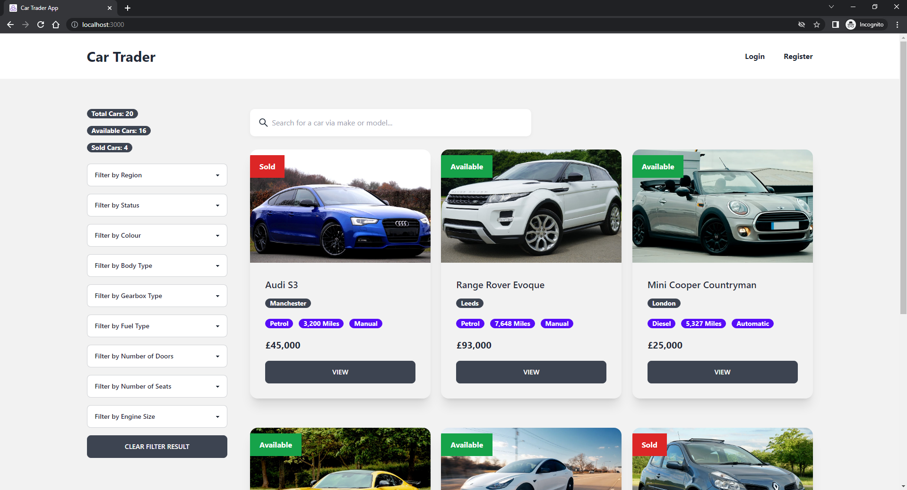
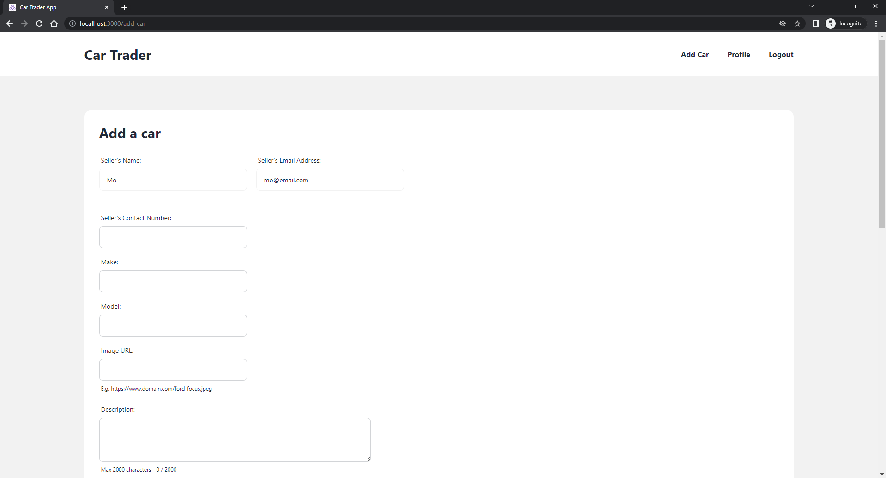
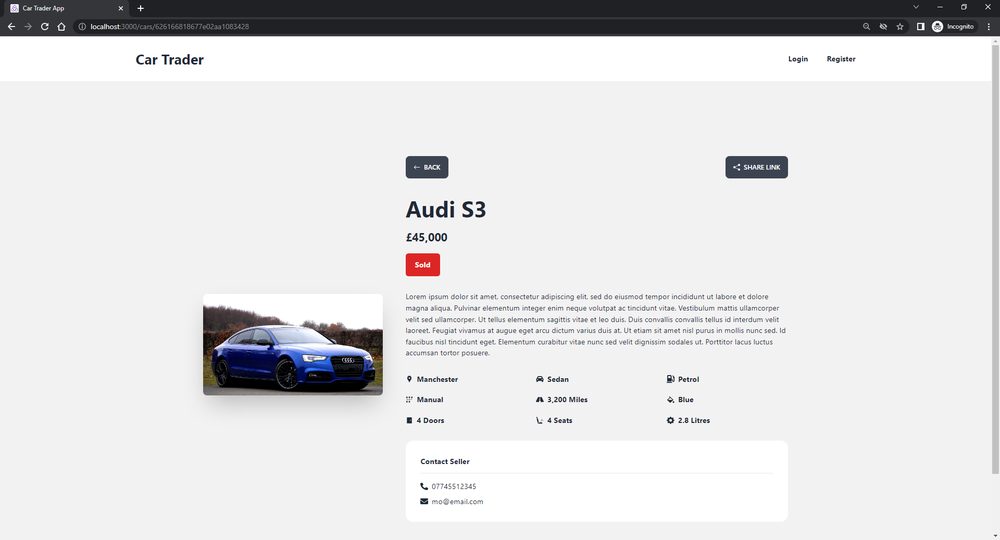
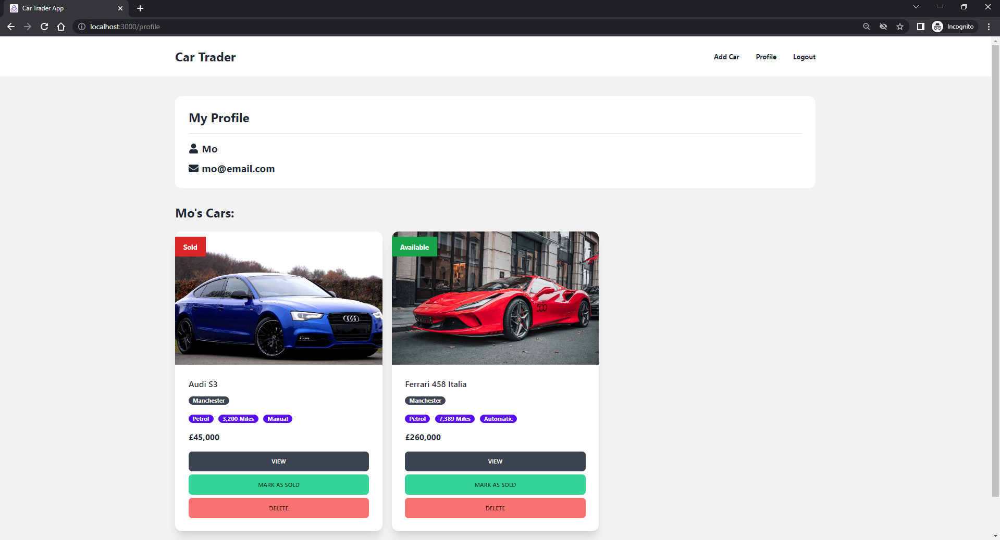

# Car Trader App

A car trader app built using the MERN stack. - [View App](http://car-trader-app-mocodes.herokuapp.com/)

This app has CRUD operations and allows users to:

- View the listing page
- Search for a car via make or model
- View car details
- Filter the cars E.g. colour, fuel type, car body type etc
- Register an account or login (Credentials stored in MongoDB)
- Add a car (Authenticated users only)
- Delete or mark their car as 'sold'

The cars are stored in MongoDB with Express and Node.js being used to power the backend. React & Redux along with Tailwind was used to build and style the frontend. HTTP requests are made from the frontend using Axios. The React Testing Library was also used to test the pages and components of the application.

## Table of contents

- [Screenshots](#screenshots)
- [Technologies](#technologies)
- [Languages](#languages)
- [Future development plans](#features-for-future-development)
- [Contact](#contact)

## Screenshots

## Technologies

- React
- React Hooks, React Router, React Testing Library
- Redux
- Axios
- MongoDB
- Node.js and NPM
- Express
- Tailwind
- Postman
- Git & GitHub
- Visual Studio Code (IDE)

## Languages

- JavaScript

## Features for future development

- Allow authenticated users to add cars to a wishlist page

## Contact

Coded by Mo - [mocodes](https://mocodes.co.uk/)

Twitter: [@mocodes\_](https://twitter.com/mocodes_)
